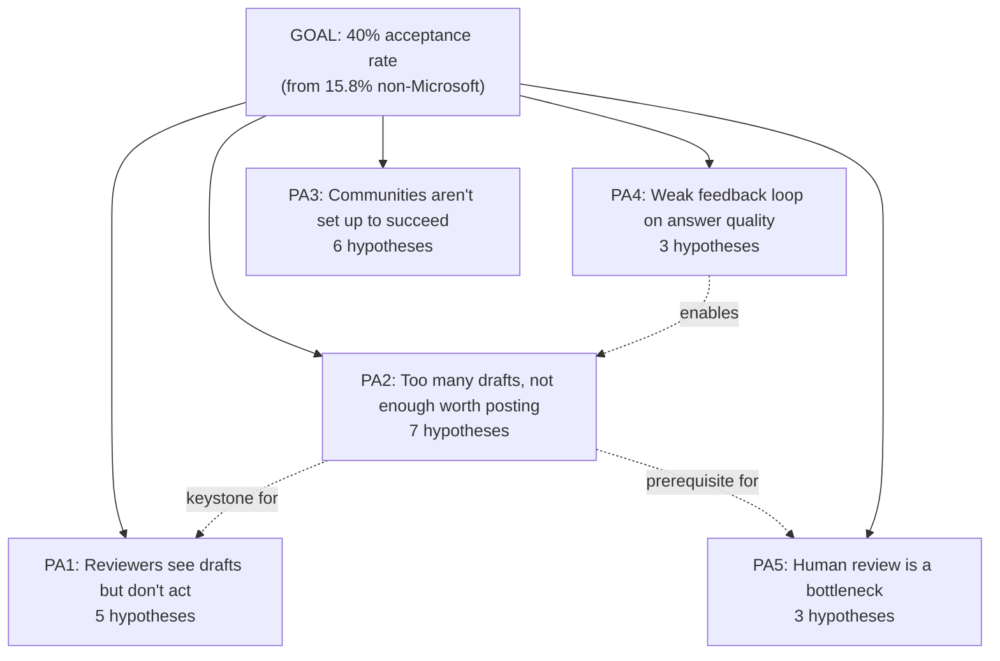
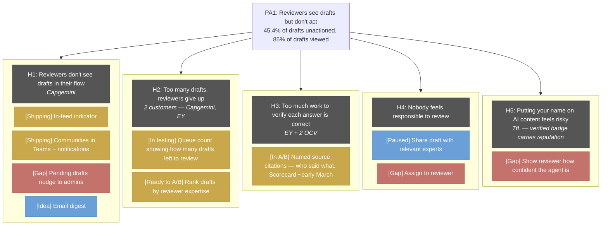
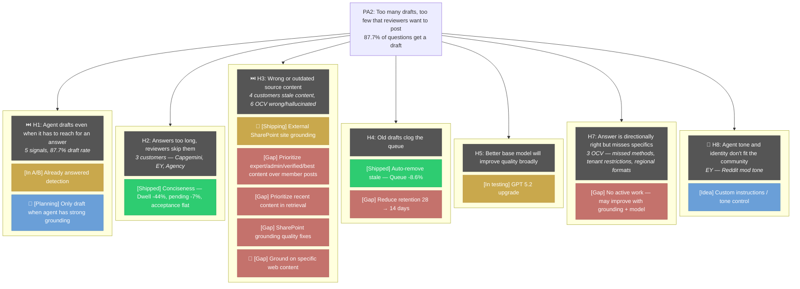
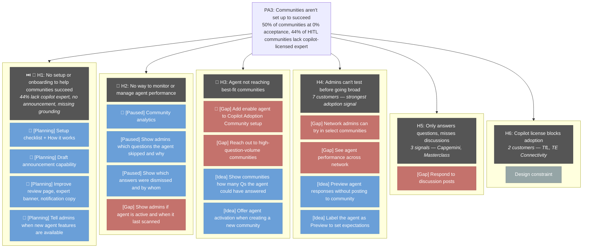
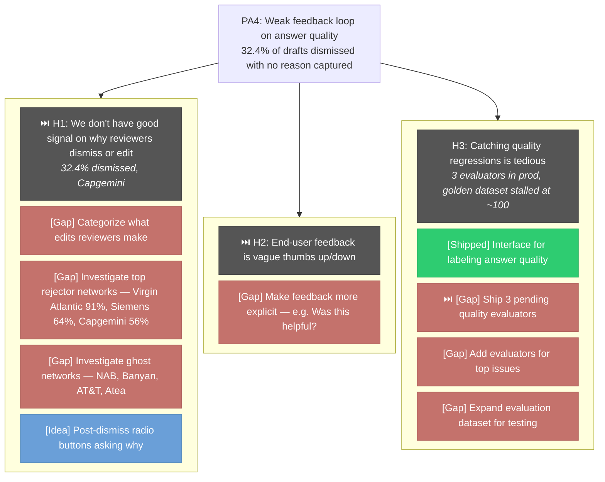
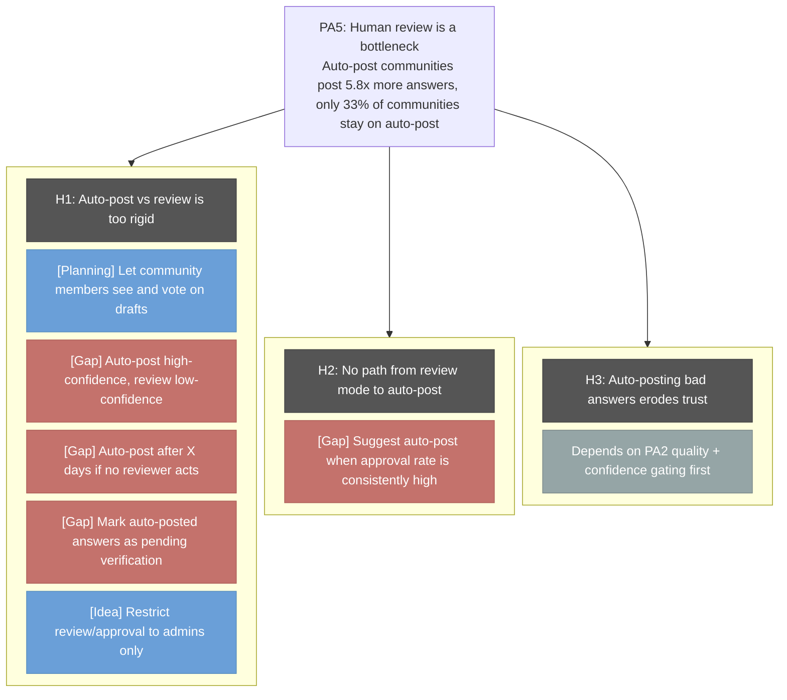

# Hypothesis Tree — Visual

**Goal:** 40% acceptance rate (from 15.8% non-Microsoft)
**Framework:** Goal → Problem Area → Hypothesis → Test → Result
**Portfolio:** 29 hypotheses, 59 tests — 3 shipped, 9 active, 19 planning/backlog, 28 gaps
**Last updated:** 2026-02-25

### Legend
| Color | Status |
|-------|--------|
| 🟢 Green | Shipped / results available |
| 🟡 Amber | Active — In A/B, In testing, Shipping, Ready to A/B |
| 🔵 Blue | Planning / Idea / Paused |
| 🔴 Red | Gap — no work in flight |
| ⬜ Gray | Dependency / design constraint |

🎯 = Critical for AI adoption communities
⏭️ = Want to do next

---

## Overview

**Key dependencies:**
- **PA2 is the keystone.** Confidence gating reduces queue (PA1), enables trust model evolution (PA5)
- **PA4 enables PA2 + PA1.** Without dismiss reasons and regression detection, improvements are signal-guided
- **PA3 is the fastest path** to moving the non-Microsoft acceptance rate (15.8%)
- **85% of drafts are viewed** — pending is "saw it, didn't act," not a discovery problem

---

## Problem Area 1: Reviewer Workflow

---

## Problem Area 2: Draft Quality

---

## Problem Area 3: Adoption Gaps

---

## Problem Area 4: Diagnostics

---

## Problem Area 5: Trust Model

